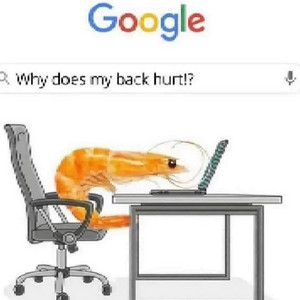
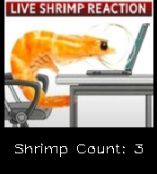
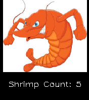

# `ShrimpPOV`

`ShrimpPOV` is a real-time posture estimator used to detect and notify a user upon entering a bad posture state. Good and bad posture is detected, then reflected by these two images:

*Good*:

*Bad*:

In order for `ShrimPOV` to work properly, you should be in a well lit room with a front facing (web)camera. I have tried using a webcam with a side angle, and do have bounds that account for that, but best results would be from a front facing angle.